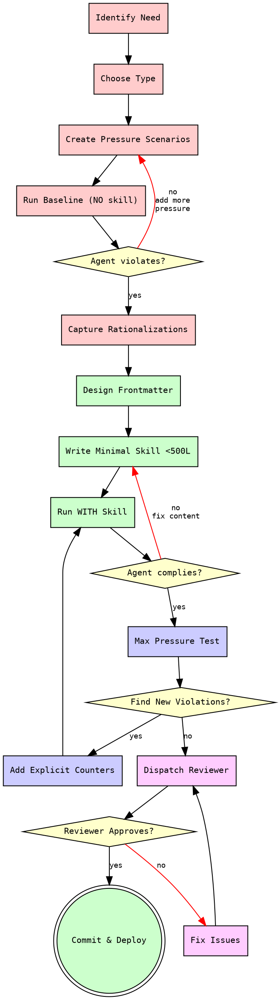
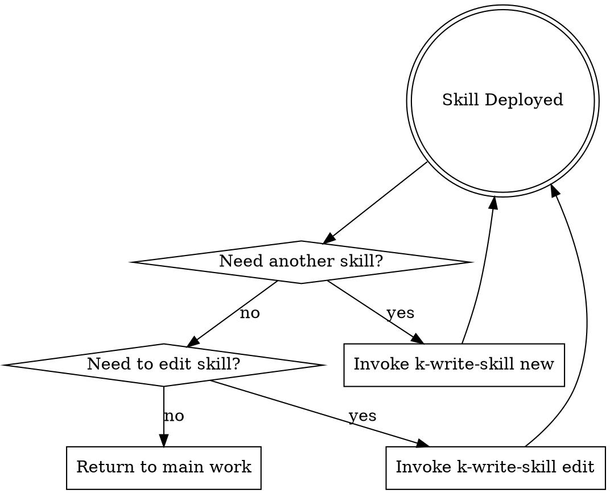

# Writing Skills with TDD

**Writing skills IS Test-Driven Development applied to process documentation.**

You write test cases (pressure scenarios with subagents), watch them fail (baseline behavior), write the skill (documentation), watch tests pass (agents comply), and refactor (close loopholes).

<HARD-GATE>
NO SKILL WITHOUT A FAILING TEST FIRST.

This is the Iron Law. Delete untested skill content immediately and start over with RED phase.

**No exceptions:**
- Not for "simple skills"
- Not for "just references"
- Not for "documentation updates"
- Not if you "already tested manually"
- Delete means DELETE - start over
</HARD-GATE>

## Current Context (Dynamic)

Session tracking and environment state:

- **Your skills**: !`ls -1 ~/.claude/skills/ 2>/dev/null | wc -l` skills installed
- **Git status**: !`git -C ~/.claude/skills status --short 2>/dev/null | head -5 || echo "Not tracked"`
- **Session ID**: ${CLAUDE_SESSION_ID}
- **Timestamp**: !`date +"%Y-%m-%d %H:%M:%S"`
- **Working on**: $ARGUMENTS

## Mandatory Checklist

**YOU MUST:**
1. Create TodoWrite todos for EACH item below
2. Complete them IN ORDER
3. Mark completed IMMEDIATELY after finishing each

Do NOT batch completions. Do NOT skip items.

### Phase 🔴 RED - Write Failing Test

**Goal:** Prove agents need this skill by watching them fail without it.

- [ ] **Identify skill need** - What specific problem requires documentation?
- [ ] **Choose skill type** - Discipline/Technique/Pattern/Reference (see Quick Reference)
- [ ] **Create pressure scenarios** - 3+ combined pressures (time + sunk cost + authority)
- [ ] **Run baseline WITHOUT skill** - Use Task tool with subagent, NO skill loaded
- [ ] **Capture rationalizations VERBATIM** - Record exact words agent uses to justify violations
- [ ] **Identify violation patterns** - What triggers non-compliance? When does agent rationalize?
- [ ] **Document baseline results** - Save to `testing-logs/${CLAUDE_SESSION_ID}/baseline-[skill-name].md`

**Output:** Baseline behavior documented with specific rationalizations captured.

### Phase 🟢 GREEN - Write Minimal Skill

**Goal:** Write skill that makes tests pass, addressing only observed failures.

- [ ] **Design frontmatter** - See `references/frontmatter-reference.md` for all fields
- [ ] **Write core content <500 lines** - Address baseline failures ONLY (no hypotheticals)
- [ ] **Optimize description for CSO** - See `references/cso-optimization.md` for rules
- [ ] **Add ONE excellent example** - Well-commented, from real scenario, ready to adapt
- [ ] **Create supporting files** - If >500 lines, split to `references/` or `templates/`
- [ ] **Run scenarios WITH skill** - Same pressure scenarios, skill now loaded
- [ ] **Verify agents comply** - Tests should pass now
- [ ] **Document GREEN results** - Save to `testing-logs/${CLAUDE_SESSION_ID}/with-skill-[skill-name].md`

**Output:** Minimal skill that makes baseline tests pass.

### Phase 🔵 REFACTOR - Close Loopholes

**Goal:** Plug all rationalization holes until skill is bulletproof.

- [ ] **Run max pressure scenarios** - Stack all pressures: time + cost + authority + exhaustion
- [ ] **Identify NEW rationalizations** - What workarounds did agent find?
- [ ] **Add explicit counters** - For each rationalization, add "Don't X" rule
- [ ] **Build rationalization table** - Format: Excuse | Reality | Counter
- [ ] **Create red flags list** - Self-check symptoms of about-to-violate
- [ ] **Re-test with counters** - Run scenarios again with updated skill
- [ ] **Repeat until bulletproof** - No violations under maximum pressure
- [ ] **Document final test** - Save to `testing-logs/${CLAUDE_SESSION_ID}/final-[skill-name].md`

**Output:** Bulletproof skill with explicit counters for all known rationalizations.

### Phase 🚀 DEPLOY - Quality Gate & Commit

**Goal:** Professional deployment with quality checks.

- [ ] **Dispatch skill-reviewer subagent** - Use `prompts/skill-reviewer-prompt.md`
- [ ] **Fix review issues** - Address all problems found
- [ ] **Re-dispatch if needed** - Max 5 iterations, escalate to human if stuck
- [ ] **Update session log** - Append to `logs/${CLAUDE_SESSION_ID}/skills-created.md`
- [ ] **Commit with convention** - `feat(skills): add [skill-name] with TDD validation`
- [ ] **Verify deployment** - Test `/skill-name` invocation works
- [ ] **Test auto-invoke** - Ask question matching description, verify skill loads

**Output:** Deployed, tested, committed skill ready for production use.

## Process Flow Diagram



**Colors:** RED (baseline testing) → GREEN (write skill) → BLUE (refactor) → PURPLE (deploy)

## Quick Reference Tables

### Skill Types vs Testing Strategy

| Type | Purpose | Test Method | Success Criteria |
|------|---------|-------------|------------------|
| **Discipline** | Enforce rules/processes | Pressure scenarios (time + cost + authority) | Complies under maximum stress |
| **Technique** | How-to guides | Application scenarios + edge cases + missing info | Applies correctly to new situations |
| **Pattern** | Mental models | Recognition scenarios + counter-examples | Identifies when/how to apply |
| **Reference** | API docs/syntax | Retrieval scenarios + application tests | Finds info + uses correctly |

### Pressure Types for Testing

| Pressure | How to Apply | Example |
|----------|--------------|---------|
| **Time** | "You have 5 minutes" / "Quick task" | Forces shortcuts |
| **Sunk Cost** | "You already wrote 200 lines" | Resists deletion |
| **Authority** | "Senior dev wants it this way" | Overrides best practices |
| **Exhaustion** | "This is iteration 8" | Weakens discipline |
| **Combination** | Stack 3+ pressures | Reveals true compliance |

### Frontmatter Quick Guide

```yaml
---
# REQUIRED for skill identification
name: skill-name                      # Kebab-case, letters-numbers-hyphens only, <64 chars

# RECOMMENDED for Claude discovery
description: >                        # Start with "Use when", NO workflow summary
  Use when [specific trigger conditions and symptoms].
  Technology-agnostic unless skill is tech-specific.

# OPTIONAL invocation control
disable-model-invocation: true        # true = user-only, false = Claude can auto-load
user-invocable: false                 # false = hide from menu, true = show in /

# OPTIONAL execution context
context: fork                         # fork = run in subagent, (empty) = inline
agent: Explore                        # Subagent type when context=fork

# OPTIONAL autocomplete help
argument-hint: [issue-number] [format]  # Shows in CLI autocomplete

# OPTIONAL tool restrictions
allowed-tools: Read, Grep, Glob       # Tools usable without approval when skill active

# OPTIONAL model override
model: opus                           # opus/sonnet/haiku - overrides default

# OPTIONAL lifecycle hooks
hooks:
  user-prompt-submit:
    before: echo "Pre-processing..."
---
```

### File Size Limits

| Component | Max Size | Action if Exceeded |
|-----------|----------|-------------------|
| SKILL.md | 500 lines | Split to `references/` |
| Reference file | 1000 lines | Consider further splitting |
| Example code | 100 lines | Extract to separate file |
| Template | 200 lines | Keep focused, one pattern |

### Supporting File Organization

| Content Type | Location | Purpose |
|--------------|----------|---------|
| Heavy reference (API docs) | `references/api-complete.md` | Detailed documentation Claude loads when needed |
| Reusable patterns | `references/patterns.md` | Pattern catalog for reference |
| Code templates | `templates/basic.md` | Copy-paste starting points |
| Testing guides | `references/testing.md` | How to test this skill type |
| Subagent prompts | `prompts/reviewer.md` | Prompts for dispatching subagents |
| Examples | `examples/sample.md` | Complete working examples |

## Supporting Materials Index

**Must read BEFORE creating skill:**
- **TDD Complete Guide**: `references/tdd-complete-guide.md` - Full RED-GREEN-REFACTOR cycle
- **Frontmatter Reference**: `references/frontmatter-reference.md` - All fields explained with examples
- **CSO Optimization**: `references/cso-optimization.md` - Description optimization rules

**Read during testing phase:**
- **Testing Methodology**: `references/testing-methodology.md` - Pressure scenarios with subagents
- **Anti-Patterns**: `references/anti-patterns.md` - Violations catalog with fixes

**Read when needed:**
- **Dynamic Injection**: `references/dynamic-injection.md` - `!`command`` patterns for real-time data

**Templates (choose one based on skill type):**
- `templates/discipline-skill.md` - TDD, verification, process enforcement
- `templates/technique-skill.md` - How-to guides, step-by-step methods
- `templates/reference-skill.md` - API documentation, syntax guides
- `templates/pattern-skill.md` - Mental models, ways of thinking

**Subagent Dispatch Prompts:**
- `prompts/skill-tester-prompt.md` - Test skill under pressure
- `prompts/skill-reviewer-prompt.md` - Quality gate before deployment

## Red Flags - STOP and Start Over

If you think ANY of these, STOP. Delete untested content. Start RED phase.

| Red Flag Thought | Reality | Action |
|------------------|---------|--------|
| "Skill is obviously clear" | Clear to you ≠ clear to other agents | Test it anyway |
| "It's just a reference" | References have gaps, unclear sections | Test retrieval |
| "Testing is overkill" | Untested skills always have issues | 15 min testing > hours debugging |
| "I'll test if problems emerge" | Problems = agents can't use skill | Test BEFORE deploying |
| "Too tedious to test" | More tedious to fix broken skill later | Do it now |
| "I'm confident it's good" | Overconfidence guarantees issues | Test anyway |
| "Manual testing is enough" | Manual ≠ pressure scenarios | Use subagents |
| "This is different because..." | It's not. Same Iron Law applies | Start RED phase |
| "I already wrote the skill" | **VIOLATION - DELETE IT** | Delete. Start RED. |

**ALL of these mean: DELETE untested content. START RED phase.**

## Common Rationalizations Table

Build this during REFACTOR phase for your skill. Here are universal ones:

| Excuse | Reality | Counter in Skill |
|--------|---------|------------------|
| "Too simple to test" | Simple code breaks. Test takes 30 sec. | Simplicity is not exemption. Test all skills. |
| "Tests after achieve same goals" | Tests-after = "what does this do?". Tests-first = "what SHOULD this do?" | Different purposes. TDD only. |
| "It's about spirit not ritual" | Violating letter = violating spirit. No workarounds. | Follow process exactly. |
| "I already manually tested it" | Manual ≠ pressure scenarios with subagents. | Use automated testing with Task tool. |
| "Skill written, just need to test" | **IRON LAW VIOLATION** - you wrote before testing. | DELETE skill. Start RED phase. |
| "No time to test" | Deploying untested = more time fixing later. | Testing is faster than debugging. |
| "I'll adapt while testing" | Adaptation = cheating. Test must be independent. | Write test. Run test. Then write skill. |

## Dynamic Context Injection Examples

Use `!`command`` syntax for real-time data:

```yaml
---
name: git-status-analyzer
description: Analyze current git repository status
---

## Current Repository State
- Branch: !`git branch --show-current`
- Status: !`git status --short`
- Recent commits: !`git log --oneline -5`
- Unstaged changes: !`git diff --stat`

## Your Task
Analyze the repository state above and suggest next actions...
```

**How it works:**
1. Commands execute BEFORE Claude sees skill
2. Output replaces `!`command`` placeholder
3. Claude receives fully-rendered prompt with actual data

**Common patterns:**
- `!`date +"%Y-%m-%d %H:%M:%S"`` - Timestamp
- `!`git status --short`` - Git state
- `!`ls -1 ~/.claude/skills/`` - Available skills
- `!`gh pr view`` - GitHub PR info
- `!`wc -l SKILL.md`` - File line count

## Session Logging Pattern

Track skill creation activity:

```bash
# Log file location
logs/${CLAUDE_SESSION_ID}/skills-created.md

# Log format
## [YYYY-MM-DD HH:MM:SS] Created: skill-name
- Type: Discipline
- Testing: 3 pressure scenarios, baseline failed, with-skill passed
- Refactor iterations: 2
- Reviewer: Approved on first try
- Commit: abc1234
```

## Example Invocations

```bash
# Create new skill
/k-write-skill new api-conventions

# Edit existing skill (must re-test)
/k-write-skill edit doc-checker

# Verify deployed skill works
/k-write-skill verify fastapi-ddd-backend

# Check skill status
/k-write-skill status
```

## After Deployment

**Verification checklist:**
- [ ] Invoke manually: `/skill-name` works
- [ ] Check listing: `What skills are available?` shows it
- [ ] Test auto-invoke: Ask question matching description
- [ ] Check file size: `wc -l SKILL.md` < 500
- [ ] Git committed: `git log -1` shows skill commit
- [ ] Session logged: Entry in `logs/${CLAUDE_SESSION_ID}/skills-created.md`

**Next actions:**
- Create another skill? Re-invoke `/k-write-skill new [name]`
- Edit this skill later? Re-invoke `/k-write-skill edit [name]` (must re-test!)
- Done with skills? Return to main conversation

## Skill Chaining Flow

After successful deployment:



**Terminal state:** Return to main conversation when all skills created/updated.

## Critical Success Factors

**What makes this skill work:**
1. **TodoWrite enforcement** - Can't skip checklist items
2. **Hard gates** - Explicit STOP conditions
3. **Subagent dispatch** - Automated testing and review
4. **Explicit counters** - Every rationalization addressed
5. **Skill chaining** - Smooth workflow continuation

**What would break it:**
1. Skipping RED phase - most common violation
2. Batching completions - loses tracking
3. Manual testing only - misses pressure scenarios
4. No rationalization table - leaves loopholes
5. Skipping reviewer - quality issues slip through

---

**Remember:** Writing skills IS writing tests. Same discipline. Same rigor. Same benefits.
