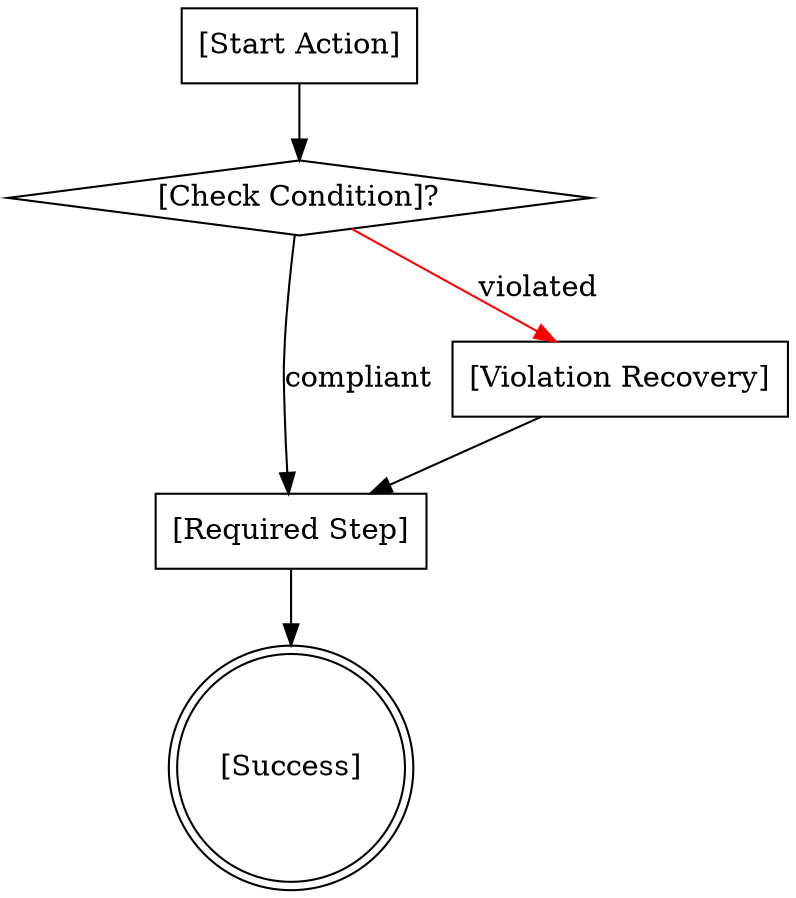

# Template: Discipline Skill

For skills that **enforce rules and processes** (TDD, verification, code review).

---
name: my-discipline-skill
description: >
  Use when [action requiring discipline], before [point of violation].
  Prevents [specific bad behaviors] under [specific pressures].
disable-model-invocation: false
---

# [Skill Name]

**[One-sentence core principle]**

<HARD-GATE>
[PRIMARY RULE IN CAPS]

**No exceptions:**
- Not for "[common excuse 1]"
- Not for "[common excuse 2]"
- Not if "[common excuse 3]"
- [Action if violated] means [ACTION] - not [workaround]
</HARD-GATE>

## Mandatory Checklist

**YOU MUST:**
1. Create TodoWrite todos for EACH item
2. Complete IN ORDER
3. Mark completed IMMEDIATELY after each

### Phase 1: [Name]
- [ ] **[Step 1]** - [What to do]
- [ ] **[Step 2]** - [What to do]
- [ ] **[Step 3]** - [What to do]

### Phase 2: [Name]
- [ ] **[Step 4]** - [What to do]
- [ ] **[Step 5]** - [What to do]

## Process Flow



## Red Flags - STOP

If you think ANY of these, STOP immediately:

- [ ] "[Common rationalization 1]"
- [ ] "[Common rationalization 2]"
- [ ] "[Common rationalization 3]"
- [ ] "[Common rationalization 4]"

**ALL of these mean: [REQUIRED ACTION]**

## Common Rationalizations Table

| Excuse | Reality | Counter |
|--------|---------|---------|
| "[Excuse 1]" | [Why it's wrong] | [Explicit counter] |
| "[Excuse 2]" | [Why it's wrong] | [Explicit counter] |
| "[Excuse 3]" | [Why it's wrong] | [Explicit counter] |

## Example Scenario

**Situation:**
[Describe realistic pressure scenario with 3+ combined pressures]

**WRONG Approach:**
```
[What agent would do if they violate]
Rationalization: "[Exact quote of excuse]"
```

**RIGHT Approach:**
```
[What agent should do following skill]
Compliance: [How they follow the rule]
```

## After Completion

**Verification:**
- [ ] [Check 1] completed
- [ ] [Check 2] passed
- [ ] [Check 3] verified

**Next actions:**
- [What to do after compliance]

---

**Remember:** [Core message about discipline]

