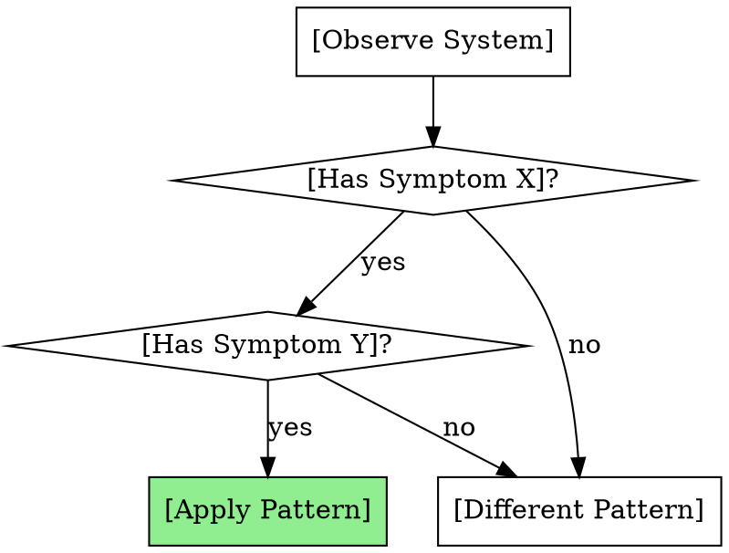

# Template: Pattern Skill

For skills teaching **mental models and ways of thinking about problems**.

---
name: my-pattern-skill
description: >
  Use when [design decision point] or [complexity symptom].
  Applies [pattern name] thinking model.
---

# [Pattern Name]

**Core Insight:** [One-sentence essence of the pattern]

## The Problem

[Describe the problem this pattern solves]

**Symptoms you're facing this problem:**
- [Symptom 1]
- [Symptom 2]
- [Symptom 3]

## The Pattern

[Explain the mental model or way of thinking]

**Key principles:**
1. [Principle 1]
2. [Principle 2]
3. [Principle 3]

## Recognition Guide

### When to Apply

**Apply when:**
- [Specific condition 1]
- [Specific condition 2]
- [Specific condition 3]

**Don't apply when:**
- [Counterexample 1]
- [Counterexample 2]

## Before/After Thinking

### Before Pattern (Confused State)

**Mental model:**
[How you think about the problem without pattern]

**Approach:**
[What you would do without pattern]

**Result:**
[What goes wrong]

### After Pattern (Clarity)

**Mental model:**
[How pattern changes your thinking]

**Approach:**
[What you do with pattern]

**Result:**
[What improves]

## Application Process

### Step 1: Identify

**Question to ask:** [Key question]

**What to look for:**
- [Indicator 1]
- [Indicator 2]

### Step 2: Analyze

**Question to ask:** [Key question]

**Framework:**
[Analytical framework to apply]

### Step 3: Apply

**Action:** [What to do]

**Guidelines:**
- [Guideline 1]
- [Guideline 2]

### Step 4: Validate

**Check:** [What to verify]

**Success looks like:**
- [Outcome 1]
- [Outcome 2]

## Concrete Example

### Scenario

[Realistic situation]

### Without Pattern

**Thinking:**
"[How you'd approach without pattern]"

**Actions:**
1. [Action 1]
2. [Action 2]

**Problems:**
- [Problem 1]
- [Problem 2]

### With Pattern

**Thinking:**
"[How pattern changes approach]"

**Actions:**
1. [Different action 1]
2. [Different action 2]

**Improvements:**
- [Improvement 1]
- [Improvement 2]

## Common Misapplications

### Misapplication 1: [Name]

**What people do:** [Incorrect application]

**Why it's wrong:** [Explanation]

**Correct approach:** [Right way]

### Misapplication 2: [Name]

[Repeat structure]

## Pattern Variations

### Variation: [Context]

**When:** [Specific situation]

**Adaptation:**
[How pattern adjusts]

**Example:**
[Brief example]

## Related Patterns

### [Related Pattern 1]

**Relationship:** [How they relate]

**When to use instead:** [Conditions]

**When to combine:** [How to use together]

### [Related Pattern 2]

[Repeat structure]

## Exercises

### Exercise 1: Recognition

**Scenario:** [Description]

**Question:** Does this pattern apply? Why or why not?

**Answer:** [Explanation]

### Exercise 2: Application

**Scenario:** [Description]

**Task:** Apply the pattern.

**Solution:** [Step-by-step application]

## Quick Reference

| Observe | Ask | Apply |
|---------|-----|-------|
| [Symptom] | [Key question] | [Action] |
| [Symptom] | [Key question] | [Action] |

